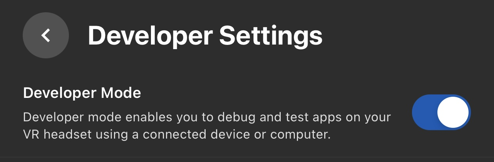
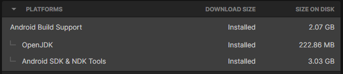
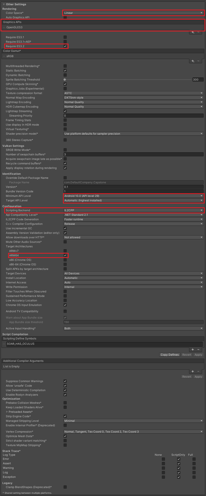
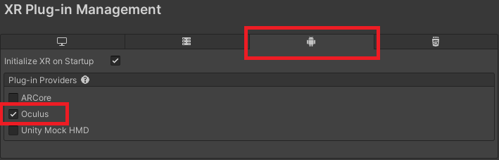
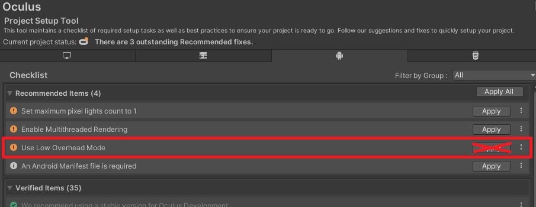

# **W23-Capstone VR&AR Unity**
This project simply provides a scene that the users can interact with 3D objects and Soar volumetric capture.

## **Environment setup**
Below are some tips for setting up the environment
### Oculus Quest
- Developer mode: First thing is to turn on the Developer Mode for Oculus Quest

- [Meta Quest Developer Hub](https://developer.oculus.com/documentation/unity/ts-odh/#set-up): A software that helps the system connect to Oculus Quest.
### Unity
- Unity Editor: Android target platform.

- [Unity Oculus Integration SDK](https://developer.oculus.com/downloads/package/unity-integration/): An all-in-one Unity Package. The one used in this project is provided: [here]()

- [Unity XR Plug-in Management](https://docs.unity3d.com/Packages/com.unity.xr.management@4.3/manual/index.html): A Unity plug-in that can be found in Unity Package Manager.

- Project Settings
    - Player:
    
    
    - XR Plug-in Management:
    
    
    - Oculus: Do NOT use Low Overhead Mode while Soar SDK is setup to URP (Universal Render Pipeline) mode
    
    
### Soar SDK
- Soar Unity Package: An all-in-one Unity Package for Soar SDK. The one used in this project is provided: [here]()
